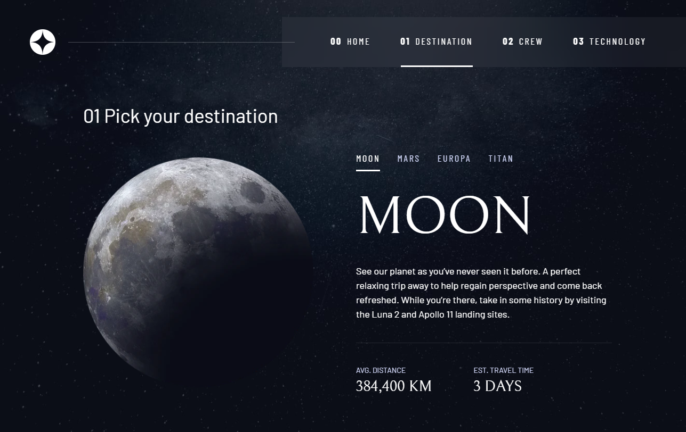
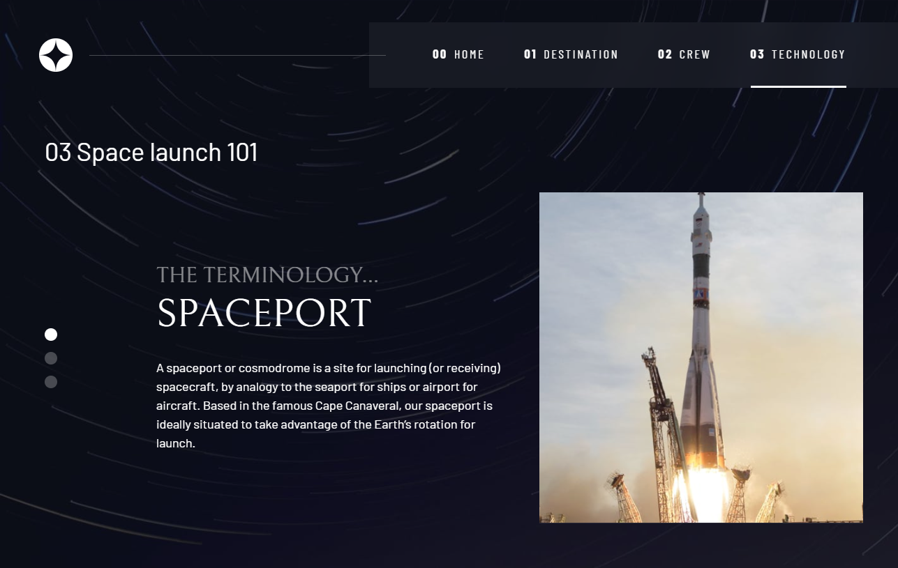

# Space tourism website

This is a solution to the multi-page Space tourism website with HTML, CSS, and JavaScript. 

## Table of contents

- [Overview](#overview)
  - [Links](#links)
  - [Built with](#built-with)
  - [Screenshot](#screenshot)

**Note: Delete this note and update the table of contents based on what sections you keep.**

## Overview

### Link

- [Space tourism website](https://your-solution-url.com)

### Built with

- Semantic HTML5 markup
- CSS custom properties
- Flexbox
- CSS Grid
- Mobile-first workflow
- JavaScript

### Screenshot

Users should be able to:

- View the optimal layout for each of the website's pages depending on their device's screen size
- See hover states for all interactive elements on the page
- View each page and be able to toggle between the tabs to see new information

